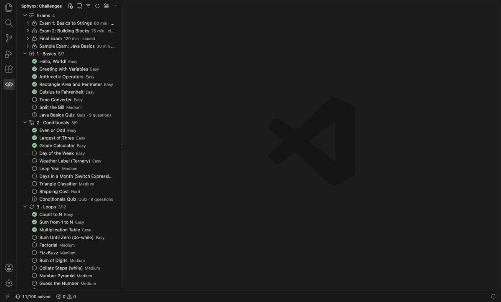
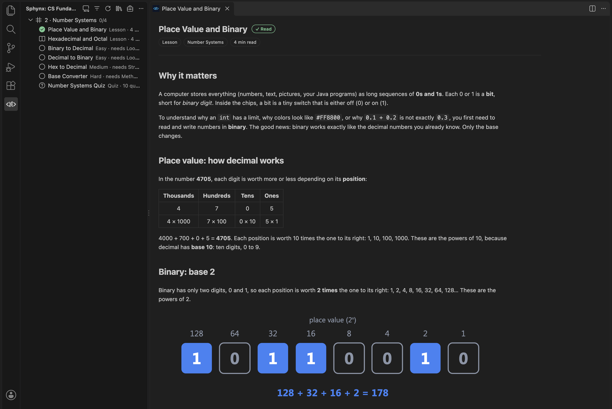
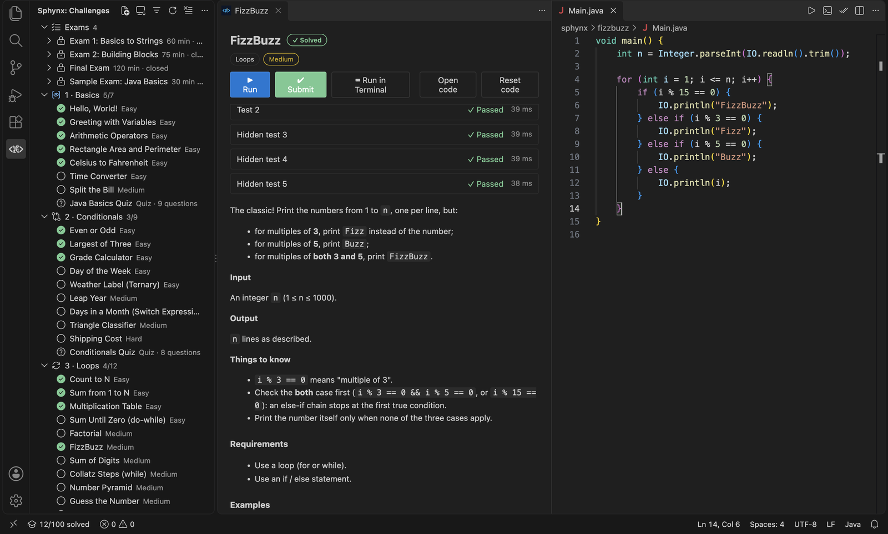
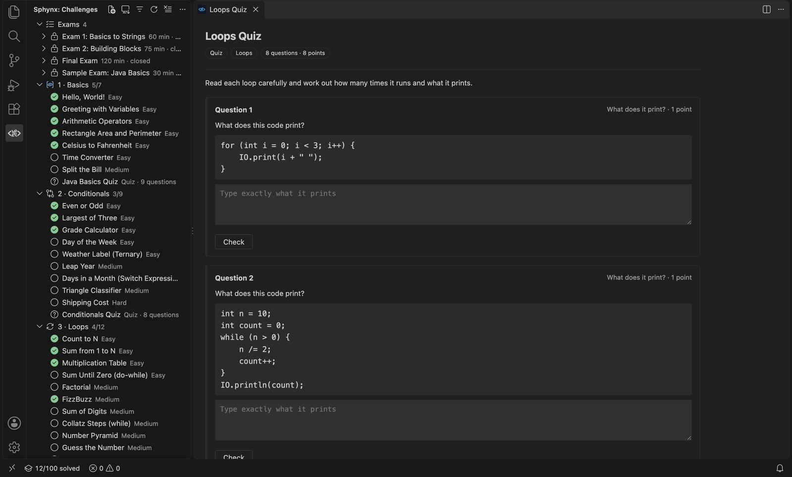
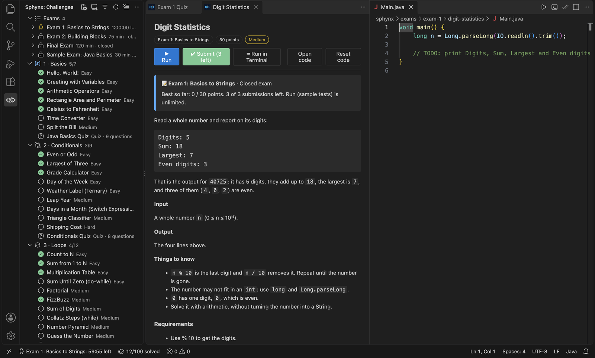
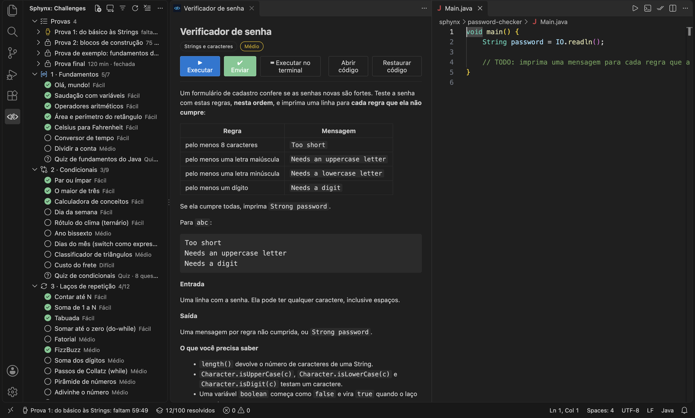

<p align="center">
  
</p>

# Sphinx Challenges for VS Code

[](https://marketplace.visualstudio.com/items?itemName=lleonardogr.sphynx)
[](https://marketplace.visualstudio.com/items?itemName=lleonardogr.sphynx)
[](https://open-vsx.org/extension/lleonardogr/sphynx)
[](https://github.com/lleonardogr/sphinx-vscode/actions/workflows/ci.yml)
[](https://github.com/lleonardogr/sphinx-vscode/releases/latest)
[](LICENSE)

> *Like the sphinx of the legend, Sphinx asks you questions, and you only pass if you answer them right.*

HackerRank / LeetCode-style coding challenges right inside VS Code, in **English or Portuguese**, running fully offline on the student's machine, with optional **AI hints** from a local model or your own API key. Two subjects ship with it: **Java Programming**, from the basic syntax to data structures, object-oriented programming and the Stream API, and **CS Fundamentals**, the theory new students need about how computers work, starting with number systems.

📘 **Guides:** [Creating your own challenges](docs/creating-challenges.md) · [Tests](docs/creating-challenges.md#tests-mixed-challenges) · [Quizzes](docs/quizzes.md) · [Exams](docs/exams.md) · [AI hints](docs/ai-hints.md) · [Content guide](docs/content-guide.md)

Students pick a challenge from the **Sphinx** sidebar. The problem statement opens on the left and a `Main.java` file on the right. **Run** checks the sample tests, **Run with this input** and **Run in Terminal** let them try their own input, and **Submit** also runs the hidden tests and marks the challenge as solved.

**[Install from the VS Code Marketplace](https://marketplace.visualstudio.com/items?itemName=lleonardogr.sphynx)**, or search for **Sphinx** in the Extensions view. Using **Cursor**, VSCodium or Windsurf? It's on **[Open VSX](https://open-vsx.org/extension/lleonardogr/sphynx)** too.



## The learning path (100 challenges)

The sidebar lists numbered **units** in teaching order. Each unit runs from easy to harder challenges, ends with its quiz, and the last unit of a stage ends with a bigger **test** that mixes everything so far. Units can open with a **quick guide**: a one-minute summary around a short code example, the mistake to watch out for, and one curated page to read (units 1 and 2 have one so far).

| Unit | Challenges | Quiz and tests |
|------|------------|----------------|
| 1 · Basics | Hello World · Greeting with Variables · Arithmetic Operators · Rectangle Area · Celsius to Fahrenheit · Time Converter (`/` and `%`) · Split the Bill (rounding cents) | Java Basics Quiz |
| 2 · Conditionals | Even or Odd · Largest of Three · Grade Calculator (`if`/`else if`) · Day of the Week (`switch` statement) · Weather Label (ternary `? :`) · Leap Year · Days in a Month (switch expression) · Triangle Classifier · Shipping Cost (chained rules) | Conditionals Quiz |
| 3 · Loops | Count to N (`for`) · Sum 1..N · Multiplication Table · Sum Until Zero (`do-while`) · Factorial · FizzBuzz · Sum of Digits (`while`) · Collatz Steps (`while`) · Number Pyramid (nested loops) · Guess the Number · Primes up to N | Loops Quiz · Test: Calculator Menu |
| 4 · Strings & Characters | Reverse a String · Count Vowels · Initials · Title Case · Palindrome · Password Checker · Anagrams · String Compression (`StringBuilder`) | Strings Quiz · Test: Hangman Referee |
| 5 · Methods | Max of Three · Temperature Table · Prime Numbers · Power · GCD and LCM · Overloaded `area()` · Perfect Numbers (helper methods) | Methods Quiz |
| 6 · Arrays | Array Sum · Largest and Smallest · Reverse an Array · Count Occurrences · Above Average (for-each) · Second Largest · Rotate an Array · Bubble Sort · Matrix Sums (2D) · Binary Search · Tic-Tac-Toe Winner (2D) | Arrays Quiz |
| 7 · Collections | To-Do List (`ArrayList`) · Unique Words (`HashSet`) · First Occurrences (`LinkedHashSet`) · Word Frequency (`HashMap`) · Phone Book (`TreeMap`) · Ticket Queue (`ArrayDeque`) · Weekly Hours (`EnumMap`) · Balanced Brackets (stack) · Most Common Words | Collections Quiz · Tests: Grade Book Menu · Inventory Menu |
| 8 · Object-Oriented Programming | Your First Class · Rectangle Class · Book with `toString()` · Points as Records · ID Generator (`static`) · Bank Account (encapsulation) · Coins (`enum`) · Shapes (inheritance) · Animals (interfaces) · Equal Points (`equals`/`hashCode`) · Payroll (polymorphism) | OOP Quiz · Test: Library System |
| 9 · Exceptions | Safe Division (`try`/`catch`) · Parse Numbers · Ask Until Valid · Insufficient Funds (custom exception) · Robust Calculator | Exceptions Quiz |
| 10 · Recursion | Recursive Factorial · Recursive Digit Sum · Fibonacci (memoization) · Recursive Palindrome · Tower of Hanoi | Recursion Quiz |
| 11 · Lambdas & Streams | Sort with a Comparator (lambdas) · Even Squares (`filter`/`map`) · Stream Statistics · Clean Up a Name List (`distinct`/`sorted`) · Pass or Fail (`partitioningBy`) · Group Words by Length (`groupingBy`) · Top 3 Scorers (comparators, `limit`) · Word Index (`flatMap`). Solved without loops. | Streams Quiz · Test: Student Report |
| Custom | Word Counter · Grade Report · Caesar Cipher: [example custom challenges](custom/) to copy when writing your own | |

Three exams close the stages, each with a quiz and three private coding questions: **Exam 1: Basics to Strings** (units 1–4, 60 minutes), **Exam 2: Building Blocks** (units 5–7, 75 minutes) and the **Final Exam** (the whole course, focused on units 8–11, 120 minutes).

## CS Fundamentals

The second subject covers what new students should know about **how a computer works**: 8 units, from the processor and memory to number systems, text, logic, algorithms and networks, with 8 reading guides, 8 quizzes, 32 challenges, 2 tests and 2 exams. Switch to it with the 📚 button at the top of the sidebar (**Switch Subject…**). Each unit starts with a **reading guide**: a short summary with a diagram, the unit's objectives, and curated videos, articles and interactive pages from the web. Then come challenges solved in Java and a quiz:

| Unit | Lessons | Challenges (plus the unit's quiz) |
|------|---------|-----------------------------------|
| 1 · How Computers Work | How a Computer Works (reading guide: Crash Course, GeeksforGeeks) | Instruction Decoder · Stack Machine · Cache Simulator · Tiny CPU (a fetch–decode–execute simulator) |
| 2 · Number Systems | Number Systems (reading guide: Math is Fun, Cisco Binary Game) | Binary to Decimal · Decimal to Binary · Hex to Decimal · Base Converter (any base from 2 to 36) |
| 3 · Bits and Bytes | Bits and Bytes (reading guide: Crash Course, NIST, GeeksforGeeks) | How Many Bits? · Storage Units (MB vs MiB) · Download Time · Read a BMP Header (little-endian) |
| 4 · Representing Numbers | Representing Numbers (reading guide: Ben Eater, The Floating-Point Guide, Computerphile) | Two's Complement · Read a Signed Byte · Overflow Detector · Binary Fractions · Test: Programmer's Calculator |
| 5 · Text, Images and Sound | Text, Images and Sound (reading guide: Crash Course, Joel Spolsky on Unicode) | Case Flipper · Run-Length Encoding · Hex Colors (and readable text) · UTF-8 Encoder |
| 6 · Logic and Bitwise Operations | Logic and Bitwise Operations (reading guide: Crash Course, NandGame, GeeksforGeeks) | Parity Bit · Permission Flags · Ripple-Carry Adder · 8-bit Register |
| 7 · Algorithms and Complexity | Algorithms and Complexity (reading guide: Crash Course, CS50, VisuAlgo) | Search Steps · Selection Sort Trace · Fast Power (O(log n)) · Pair Sum: Slow and Fast |
| 8 · Networks and the Internet | Networks and the Internet (reading guide: Crash Course, How DNS Works, Packet Coders) | Valid IPv4 Address · Read an HTTP Request · Subnet Calculator · Routing Table (longest prefix match) · Test: Packet Inspector |

Two **tests** close the stages with a bigger program that mixes units: **Programmer's Calculator** (binary, hex and two's complement with carry and overflow flags, after unit 4) and **Packet Inspector** (decode a real IPv4 and UDP packet and check its checksum, after unit 8). Two closed **exams**, each with a quiz and three private coding questions: **CS Exam 1: Data Representation** (units 1–5, 90 minutes: Fits in a Type, Hex Dump, Base64 Encoder) and the **CS Final Exam** (the whole subject, focused on units 6–8, 120 minutes: Gray Code, Merge Step, DNS Resolver).



Each item shows the Java it needs, with your progress: for example **Needs: Java Programming · Loops · 7/12**. Nothing is locked.

## Screenshots

| | |
|---|---|
|  |  |
| **Learning path**: 11 units from the basics to streams, with progress | **Quizzes**: multiple choice, true or false, short answer and code output |
|  |  |
| **Exams**: timed, graded, with restriction levels | **English or Portuguese**: challenges, quizzes, exams and the interface |

## Features

- **Problem panel** with the description, examples, requirements and hints that are revealed one at a time.
- **Run / Submit** buttons in the panel and in the editor title bar (`Cmd/Ctrl+Alt+R` runs, `Cmd/Ctrl+Alt+Enter` submits).
- **Try your own input**: type any input in the problem panel and click **Run with this input** to see what your program prints. If the input matches an example, the expected output and the first differing line are shown too. It doesn't check rules and doesn't count as an attempt.
- **Run in Terminal** compiles the program and runs it in an interactive terminal, so students can type input while it runs and see exactly what it prints.
- **Clear feedback**: compiler errors show as red squiggles and link to the line, each test shows Expected vs. Your output with the first differing line, and the panel reports runtime exceptions and time-limit (infinite loop) failures.
- **Hidden tests** catch edge cases like negative numbers, zero and overflow, without revealing their input.
- **Modern Java by default, classic on request**: starter code uses Java 25+ compact source files (`void main()`, `IO.println`). Set `sphinx.java.style` to `classic` for `public class Main` starter code. Either style is **always accepted**, because only the output is checked.
- **Syntax requirements**: a challenge can require constructs (for example "use a `switch`", "create `class Square extends Shape`" or "keep `balance` private") or forbid shortcuts (`Math.max`, `reverse()`, `Math.pow`).
- **AI hints (optional, off by default)**: an AI tutor gives one hint at a time about your current code, without writing the solution. It works with a **local model** (Ollama, LM Studio: free and private), **your own API key** (Anthropic Claude or any OpenAI-compatible API), or VS Code's language models (GitHub Copilot). API keys are stored in VS Code's encrypted secret storage. See [AI hints](docs/ai-hints.md).
- **Tests**: bigger challenges that **mix several units** in one program, listed at the end of the unit they close, such as a console app with a menu (`1. Add`, `2. List`, `0. Exit`). Each one shows the skills it combines, and is graded by feeding it whole sequences of menu choices.
- **Quizzes**: short question sets (multiple choice, true or false, short answer, numbers typed in binary, decimal or hexadecimal, and "what does this code print?"), with instant feedback and explanations in practice. Exams can include them as graded questions, and the validator runs every code question to make sure its answer is right. See [Quizzes](docs/quizzes.md).
- **Exams**: timed, graded sets of questions with a countdown, limited submissions, partial credit and a results file to hand in. An exam can be **open** (hints, AI and the internet allowed) or **closed** (hints and AI off, copying and pasting blocked, time outside VS Code recorded or limited). Teachers re-grade the results files with **Verify Exam Results**. See [Exams](docs/exams.md).
- **Import**: one button in the sidebar imports the challenges, tests and exams a teacher shared, as a `.zip` or a folder. They're copied into the extension's library, solutions can be stripped for students, and **Remove Imported…** takes them out again. See [Sharing challenges with students](docs/creating-challenges.md#sharing-challenges-with-students).
- **Create your own challenges**: **Create New Challenge** sets up a ready-to-edit example, `challenge.json` gets autocomplete and validation, and **Validate Challenges** checks your tests and fills in the expected outputs. No Node.js needed. See [Creating your own challenges](docs/creating-challenges.md).
- **Subjects**: Java Programming and CS Fundamentals, each with its own learning path. **Switch Subject…** (📚) changes the one in the sidebar, and its name is shown in the sidebar header.
- **Lessons**: short pages to read before a unit's quiz and challenges, with a reading time, a ✓ once read, and a button to the next item.
- **Prerequisites**: an item can list the units it builds on, shown with the student's progress in each one. They're advice; nothing is locked.
- **Progress tracking** shows ✓ in the tree, a count per unit, and an `x/100 solved` counter for the current subject in the status bar.
- **Group by**: the filter button at the top of the sidebar groups challenges by **learning path** (units, the default), **difficulty** (Easy, Medium, Hard, then quizzes) or **progress** (not started, in progress, solved). The choice is remembered.

> **Upgrading from Tech Challenges?** Sphinx is the same extension with a new name. Install Sphinx and uninstall Tech Challenges. Your settings (`techChallenges.*` → `sphinx.*`) are copied over automatically, and your code in `tech-challenges/` keeps being used. Solved-challenge progress and saved AI keys start fresh.

## Getting started (students)

### 1. Install Java

Install a **JDK 25 or newer**, for example [Eclipse Temurin](https://adoptium.net/temurin/releases/). Then open a terminal and check it:

```bash
javac -version   # should print javac 25 or newer
```

If you can only use JDK 17–24, that works too: the extension offers to switch to classic Java.

Sphinx checks Java when it starts. If something is wrong, it warns you and shows **Java isn't ready** at the top of the sidebar. Run **Sphinx: Check Java Setup** at any time for a full report: which `javac` and `java` were found, their versions, whether modern and classic Java really compile and run, and how to fix each problem. If your JDK isn't on the PATH, **Sphinx: Choose JDK Folder…** points Sphinx at it. After installing Java, restart VS Code so it sees the new PATH.

### 2. Install the extension

1. Install **Sphinx** from the [VS Code Marketplace](https://marketplace.visualstudio.com/items?itemName=lleonardogr.sphynx): open the **Extensions** view (`Ctrl+Shift+X` / `Cmd+Shift+X`), search for **Sphinx**, and click **Install**.

   Or, in a terminal: `code --install-extension lleonardogr.sphynx`

   In **Cursor**, VSCodium or Windsurf, search for **Sphinx** the same way: it comes from [Open VSX](https://open-vsx.org/extension/lleonardogr/sphynx).

   No internet in the classroom? Download **`sphynx-x.y.z.vsix`** from the [latest release](https://github.com/lleonardogr/sphinx-vscode/releases/latest) and use **Install from VSIX…** in the Extensions view's **`...`** menu.
2. Open a folder for your work (**File → Open Folder…**). Your code is saved in `sphinx/<challenge>/Main.java` inside it.

### 3. Solve your first challenge

1. Click the **Sphinx** icon in the Activity Bar (left side) and choose **Hello, World!** The problem opens on the left and your `Main.java` on the right.
2. Read the description and examples, then write your code.
3. Check your work, in whichever way suits you:

   | Button | What it does |
   |--------|--------------|
   | **▶ Run** (`Cmd/Ctrl+Alt+R`) | Runs the sample tests and shows expected vs. your output. |
   | **Try your own input → Run with this input** | Runs your program once with any input you type, and shows what it prints. |
   | **⌨ Run in Terminal** | Runs your program in a terminal, so you can type the input while it runs. |
   | **✔ Submit** (`Cmd/Ctrl+Alt+Enter`) | Runs all tests, including hidden edge cases. Pass them all to solve the challenge ✓. |

4. Stuck? Click **Show a hint**, or **✨ Ask AI for a hint** if your teacher or you set up [AI hints](docs/ai-hints.md).
5. Made a mess? **Reset code** brings back the starter code.
6. Want to start over? The ↺ button next to a challenge in the sidebar (**Reset Challenge**) brings back the starter code and clears its progress; next to a quiz it clears the best score. **Reset All Challenges…**, in the **…** menu at the top of the sidebar, resets everything, either progress and code or progress only. Exams are never reset.

Your program reads its input and prints the answer, exactly like HackerRank. Both styles work:

```java
// Modern Java (JDK 25+)
void main() {
    int n = Integer.parseInt(IO.readln());      // IO.readln() reads one line
    IO.println(n * 2);
}
```

```java
// Classic Java (JDK 17+)
import java.util.Scanner;

public class Main {
    public static void main(String[] args) {
        Scanner scanner = new Scanner(System.in);
        int n = scanner.nextInt();
        System.out.println(n * 2);
    }
}
```

In modern Java, `IO.readln()` reads a whole line. For several numbers on one line, split it (`IO.readln().split(" ")`) or use `new Scanner(System.in)`, which compact source files can use without an import.

The file is always `Main.java`. In classic Java, the public class must be named `Main`. Other classes (OOP challenges) go in the same file, without `public`.

### Settings

| Setting | Default | Description |
| ------- | ------- | ----------- |
| `sphinx.language` | `en` | Language of Sphinx: `en` (English) or `pt-br` (Português do Brasil). Challenges, quizzes, exams, panels and messages switch at once; the program's output stays the same in both. |
| `sphinx.java.style` | `modern` | Starter code style for new challenges: `modern` (JDK 25+) or `classic` (JDK 17+). Use **Reset Code to Starter** to switch a challenge you already opened. |
| `sphinx.java.home` | (empty) | The JDK folder, if `javac` is not on your PATH. |
| `sphinx.codeFolder` | (empty) | Where solutions are saved. |
| `sphinx.extraChallengePaths` | `[]` | Extra challenge folders provided by your teacher. |
| `sphinx.ai.provider` | `off` | AI hints provider: `ollama`, `lmstudio`, `anthropic`, `openai-compatible` or `vscode`. Run **Set Up AI Hints** for a guided setup. |

## For teachers

Click the 💼 button at the top of the Sphinx sidebar (**Switch to Teacher View**) to open the **teacher view**. It lists **My Exams** (with their questions; press ▶ **Try Exam (Preview)** to take an exam yourself with the real timer and rules, in a practice attempt you can restart that never counts as a real one), **My Challenges, Quizzes & Lessons** (what you created or imported; click one to try it), and the **Tools**: create, import, **export a pack** for your class (a `.zip` they import with one click, without the solutions), validate, and open your class's results as a **dashboard** (scores per question, time away, warnings, verification, CSV export). Your own exams, challenges, quizzes and lessons can be edited, exported and deleted from their right-click menu. Built-in content can be tried, used in your exams and graded, but not changed: it's part of the extension, and an update would undo any change. The 🎓 button switches back to the **student view**, where you can practise the learning path like your students.

### Share the extension with your class

Point students to the [Marketplace page](https://marketplace.visualstudio.com/items?itemName=lleonardogr.sphynx) (or the `.vsix` in the [latest release](https://github.com/lleonardogr/sphinx-vscode/releases/latest) for offline classrooms) and the [Getting started](#getting-started-students) steps above. Reference solutions (`Solution*.java`) are **never** included in the `.vsix`, but they are visible in this public repository.

To build the `.vsix` yourself:

```bash
npm install
npm run validate   # compiles the extension and checks every challenge against its reference solutions
npm run package    # creates sphinx-<version>.vsix
```

For a classroom without internet access, AI hints can use a model running on each computer, or on a school server. See [AI hints → For teachers](docs/ai-hints.md#for-teachers).

### Create your own challenges

Everything you need is in **[docs/creating-challenges.md](docs/creating-challenges.md)**: a 5-minute quick start, the file format, writing tests, the rules cookbook, validating, and sharing challenges with your class without rebuilding the extension.

In short: run **Sphinx: Create New Challenge…**, edit the generated files, then run **Sphinx: Validate Challenges in a Folder…** to check everything and fill in the expected outputs. Challenges without a `topic` appear in the **Custom** group. The [`custom/`](custom/) folder has three examples you can copy.

### Give an exam

Write an `exam.json` (title, duration, open or closed, submissions per question, and questions with points), share it with your class, and re-grade the results files they hand in. Questions can be any challenge, including the bigger mixed ones from the **Tests** group. A sample exam ships with the extension. See **[docs/exams.md](docs/exams.md)**.

## Roadmap

Done:

- [x] A complete Java learning path: 11 units, from the basics to OOP, exceptions, recursion and streams, with quizzes, tests and exams
- [x] AI hints tailored to the student's code (local model or your own API key)
- [x] English and Portuguese
- [x] Publish to the VS Code Marketplace and Open VSX
- [x] A teacher view: exam previews, export packs and a class results dashboard
- [x] Subjects, lessons and prerequisites, and the complete CS Fundamentals subject: 8 units with reading guides, quizzes and challenges, plus 2 tests and 2 exams
- [x] Exam retakes after a wait, and deleting your own content in the teacher view
- [x] Lessons in Import and Export packs

Content:

- [ ] Quick guides for the Java units (units 1 and 2 done)
- [ ] An algorithms and data structures unit
- [ ] New subjects: C, SQL and graph theory

For teachers:

- [ ] **Create New Lesson**, like **Create New Challenge**
- [ ] Teachers' own subjects and units, from their content folders
- [ ] Optional prerequisite locks, turned on by the teacher
- [ ] Hide exam questions in the teacher view, or protect it with a PIN
- [ ] AI help for writing new challenges

For students:

- [ ] Back up and restore progress (to move to another computer or reinstall)
- [ ] More interface languages, such as Spanish

Platform:

- [ ] Support more languages (Python, JavaScript, C, SQL, …) through a pluggable runner per language
- [ ] Publish to the Marketplace with Microsoft Entra ID before personal access tokens are retired on December 1, 2026 ([#47](https://github.com/lleonardogr/sphinx-vscode/issues/47))
- [ ] A verified publisher namespace on Open VSX

## Development

```bash
git clone https://github.com/lleonardogr/sphinx-vscode.git
cd sphinx-vscode
npm install        # dependencies + the commit-message hook
npm run compile    # type-check and build to out/
```

Open the folder in VS Code and press **F5** to launch a window with the extension loaded. Then `npm run validate` checks every challenge, `npm test` runs the unit and integration tests, and `npm run package` builds the `.vsix`.

- `main` is protected. Work on a branch, open a pull request, and wait for CI (Linux, macOS and Windows; JDK 17 and 25) before merging.
- Commits and PR titles follow [Conventional Commits](https://www.conventionalcommits.org): `feat(panel): …`, `fix(terminal): …`, `docs: …`.
- Releases are created by tagging `main` **after** merging: `git tag vX.Y.Z && git push origin vX.Y.Z`.

All the details (workflow, commit types, releasing) are in [CONTRIBUTING.md](CONTRIBUTING.md).

## Contributing

Contributions are welcome, especially new challenges! Start with [Creating your own challenges](docs/creating-challenges.md) and [CONTRIBUTING.md](CONTRIBUTING.md).

## License

[MIT](LICENSE)
