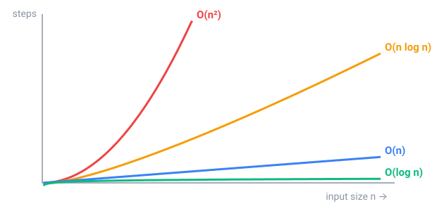

## In short

An **algorithm** is a finite list of precise steps that solves a problem, and the same problem usually has several. To find a number in a list, **linear search** checks the items one by one: up to n steps. If the list is sorted, **binary search** looks at the middle and throws away the half where the number can't be: 1,000,000 items need at most 20 steps.

To compare algorithms we count **steps**, not seconds, and describe how they grow with the input size n. **Big O** keeps only the fastest-growing part: 3n + 5 steps is O(n), n² + 100n is O(n²).

You can usually read it from the loops: one loop over the input is O(n), a loop inside a loop is O(n²), and a loop that halves (or doubles) a value is O(log n). **Selection sort**, which finds the smallest remaining number on every pass, makes about n²/2 comparisons; Java's `Arrays.sort` needs about n log n.

At a billion steps per second, sorting a million numbers in O(n log n) takes a fraction of a second; in O(n²), over 15 minutes. For big inputs, a better algorithm beats a faster computer.

<!-- readings -->

## Check yourself

1. At most how many guesses does binary search need for a number from 1 to 1000?
2. What is the Big O of a loop from 1 to n that contains another loop from 1 to n?
3. Why does binary search need a sorted list?
