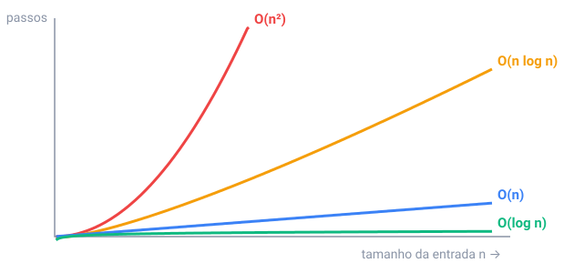

## Em resumo

Um **algoritmo** é uma lista finita de passos precisos que resolve um problema, e o mesmo problema normalmente tem vários. Para achar um número numa lista, a **busca linear** confere os itens um por um: até n passos. Se a lista estiver ordenada, a **busca binária** olha o meio e joga fora a metade em que o número não pode estar: 1.000.000 de itens precisam de no máximo 20 passos.

Para comparar algoritmos contamos **passos**, não segundos, e descrevemos como eles crescem com o tamanho n da entrada. O **Big O** fica só com a parte que cresce mais rápido: 3n + 5 passos é O(n), n² + 100n é O(n²).

Normalmente dá para ler isso nos laços: um laço sobre a entrada é O(n), um laço dentro de outro é O(n²), e um laço que divide (ou dobra) um valor é O(log n). A **ordenação por seleção**, que acha o menor número restante em cada passada, faz cerca de n²/2 comparações; o `Arrays.sort` do Java precisa de cerca de n log n.

A um bilhão de passos por segundo, ordenar um milhão de números em O(n log n) leva uma fração de segundo; em O(n²), mais de 15 minutos. Para entradas grandes, um algoritmo melhor vence um computador mais rápido.

<!-- readings -->

## Verifique

1. No máximo quantos chutes a busca binária precisa para um número de 1 a 1000?
2. Qual é o Big O de um laço de 1 a n que contém outro laço de 1 a n?
3. Por que a busca binária precisa de uma lista ordenada?
