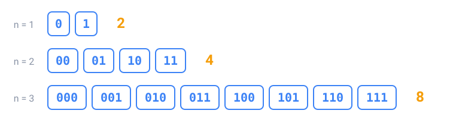

## In short

A **bit** is 0 or 1, and a **byte** is 8 bits. Every extra bit doubles the possibilities, so **n bits have 2ⁿ values**, from 0 to 2ⁿ − 1: a byte holds 0 to 255. Turned around, a number needs as many bits as the times you can halve it before reaching 0: 300 needs 9.

Sizes use two kinds of prefixes. **SI prefixes** multiply by 1000: 1 KB = 1000 bytes, 1 MB = 1000² bytes. **Binary prefixes** multiply by 1024: 1 KiB = 1024 bytes, 1 MiB = 1024² bytes. That's why a 1 TB disk shows as 931 "GB" on Windows: the same bytes divided by 1024³.

Speeds are in **bits** per second (Mbps, lower-case b) and files in **bytes** (MB, upper-case B): a 100 Mbps connection moves at most 12.5 MB per second.

A number bigger than 255 takes several bytes, and they can be stored in two orders. **Big-endian** puts the most significant byte first, as we write numbers; **little-endian** puts the least significant first. Intel and ARM processors and many file formats are little-endian; network protocols are big-endian.

| 300 = 0x012C | 1st byte | 2nd byte |
|--------------|----------|----------|
| big-endian | `01` | `2C` |
| little-endian | `2C` | `01` |

<!-- readings -->

## Check yourself

1. How many values do 10 bits hold, and how many bits does 1000 need?
2. How many bytes are in 2 MiB, and in 2 MB?
3. Which number do the little-endian bytes `E8 03` store?
