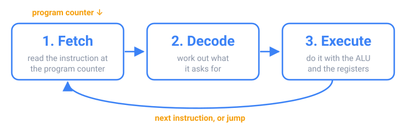

## In short

A computer has four main parts. The **CPU** runs instructions; **RAM** holds the programs and data in use right now, and forgets everything when the power goes off; **storage** (an SSD or a disk) keeps files; **input and output** devices talk to the world. To run, a program is copied from storage into RAM, because storage is far too slow for the CPU to read instructions from.

The CPU repeats one cycle billions of times per second: it **fetches** the instruction whose address is in the **program counter**, **decodes** what it asks for, **executes** it, and moves on to the next one, unless the instruction was a **jump**, which is how `if` and loops work at this level. A 3 GHz clock ticks 3 billion times per second.

RAM is about 100 times slower than the CPU, so processors keep recently used data in small, fast **caches**. Data already in the cache (a **hit**) arrives in about 1 ns; a **miss** waits about 100 ns for RAM. A miss brings a whole block of neighbouring bytes, so reading an array in order is much faster than jumping around in it.

Java adds one step: `javac` compiles your code into **bytecode**, and the **JVM** runs it, turning the code that runs most into real machine code for your CPU.

<!-- readings -->

## Check yourself

1. What does the program counter hold, and when does it not simply move to the next instruction?
2. Why can reading a big array in order be ten times faster than reading it in a random order?
3. What does `javac` produce, and what turns it into instructions your CPU can run?

The quiz checks these, and the challenges let you build a small CPU, a stack machine and a cache.
