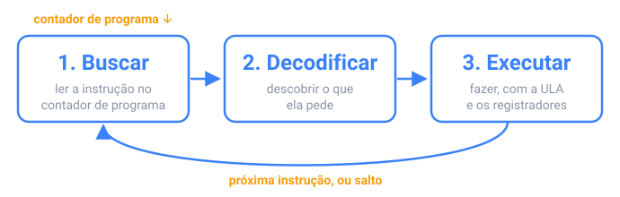

## Em resumo

Um computador tem quatro partes principais. A **CPU** executa instruções; a **RAM** guarda os programas e dados em uso agora, e esquece tudo quando a energia é desligada; o **armazenamento** (um SSD ou um disco) guarda os arquivos; os dispositivos de **entrada e saída** conversam com o mundo. Para rodar, um programa é copiado do armazenamento para a RAM, porque o armazenamento é lento demais para a CPU ler instruções dele.

A CPU repete um ciclo bilhões de vezes por segundo: ela **busca** a instrução cujo endereço está no **contador de programa**, **decodifica** o que ela pede, **executa** e passa para a próxima, a menos que a instrução seja um **salto**, que é como `if` e laços funcionam nesse nível. Um clock de 3 GHz bate 3 bilhões de vezes por segundo.

A RAM é cerca de 100 vezes mais lenta que a CPU, então os processadores guardam os dados usados recentemente em **caches** pequenos e rápidos. Um dado que já está no cache (um **acerto**) chega em cerca de 1 ns; uma **falha** espera cerca de 100 ns pela RAM. Uma falha traz um bloco inteiro de bytes vizinhos, então ler um array em ordem é muito mais rápido do que pular de um lugar para outro nele.

O Java acrescenta um passo: o `javac` compila o seu código para **bytecode**, e a **JVM** o executa, transformando o código que mais roda em código de máquina de verdade para a sua CPU.

<!-- readings -->

## Verifique

1. O que o contador de programa guarda, e quando ele não passa simplesmente para a próxima instrução?
2. Por que ler um array grande em ordem pode ser dez vezes mais rápido do que lê-lo em ordem aleatória?
3. O que o `javac` produz, e o que transforma isso em instruções que a sua CPU consegue executar?

O quiz confere essas respostas, e os desafios deixam você construir uma CPU pequena, uma máquina de pilha e um cache.
