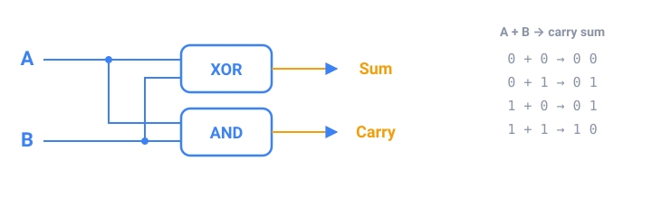

## In short

A **logic gate** takes bits in and gives one bit out. **AND** is 1 only when both inputs are 1, **OR** when at least one is, **XOR** when they differ, and **NOT** flips its input. In Java these are `&&`, `||`, `^` and `!` for booleans. **De Morgan's laws** flip a condition: `!(a && b)` is the same as `!a || !b`.

Gates also do arithmetic. Adding two bits gives a **sum** bit, which is exactly XOR, and a **carry** bit, which is exactly AND. Chain these adders, passing each carry to the next column, and you can add whole numbers: that's how the processor adds.

Java can apply a gate to all 32 bits of an `int` at once: `&`, `|`, `^` and `~`. Shifting moves bits: `x << 1` doubles, `x >> 1` halves. A **mask** is a number with only the bits you care about turned on; `1 << k` selects bit k:

| Task | Code |
|------|------|
| Is bit k on? | `(n >> k) & 1` |
| Turn it on | `n \| (1 << k)` |
| Turn it off | `n & ~(1 << k)` |
| Flip it | `n ^ (1 << k)` |

File permissions, colors and network flags all pack several yes/no values into one number this way.

<!-- readings -->

## Check yourself

1. Which gate gives the sum bit when you add two bits, and which gives the carry?
2. Rewrite `!(raining || cold)` without the outer `!`.
3. What does `n & ~(1 << 3)` do to `n`?
