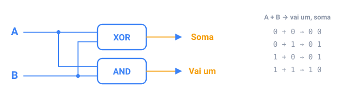

## Em resumo

Uma **porta lógica** recebe bits e devolve um bit. **AND** é 1 só quando as duas entradas são 1, **OR** quando pelo menos uma é, **XOR** quando elas são diferentes, e **NOT** inverte a entrada. No Java elas são `&&`, `||`, `^` e `!` para booleanos. As **leis de De Morgan** invertem uma condição: `!(a && b)` é o mesmo que `!a || !b`.

As portas também fazem contas. Somar dois bits dá um bit de **soma**, que é exatamente o XOR, e um bit de **vai um**, que é exatamente o AND. Encadeie esses somadores, passando cada vai-um para a próxima coluna, e você soma números inteiros: é assim que o processador soma.

O Java aplica uma porta aos 32 bits de um `int` de uma vez: `&`, `|`, `^` e `~`. Deslocar move os bits: `x << 1` dobra, `x >> 1` divide ao meio. Uma **máscara** é um número só com os bits que interessam ligados; `1 << k` seleciona o bit k:

| Tarefa | Código |
|--------|--------|
| O bit k está ligado? | `(n >> k) & 1` |
| Ligar | `n \| (1 << k)` |
| Desligar | `n & ~(1 << k)` |
| Inverter | `n ^ (1 << k)` |

Permissões de arquivos, cores e flags de rede guardam vários valores de sim/não num único número desse jeito.

<!-- readings -->

## Verifique

1. Qual porta dá o bit da soma quando você soma dois bits, e qual dá o vai um?
2. Reescreva `!(raining || cold)` sem o `!` de fora.
3. O que `n & ~(1 << 3)` faz com `n`?
