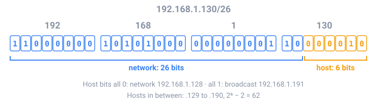

## In short

The internet never sends a file in one piece. It cuts data into **packets** of about 1500 bytes, each with a **header** (where it comes from and where it goes) and a piece of the data. **Routers** pass each packet one hop closer to its destination; packets can take different routes and arrive out of order.

Every device has an **IP address**: 4 bytes written like `192.168.1.130`, which to the computer is one 32-bit number. A **prefix** such as `/26` says how many of those bits name the **network**; the rest number the **hosts** in it.

All host bits 0 is the **network address**, all 1 is the **broadcast address**, and the addresses in between are for devices. A router chooses where to send a packet by the **longest prefix** in its table that matches the destination.

On top of IP, **TCP** numbers the data, confirms what arrived and resends what was lost, so pages and files arrive complete and in order. **UDP** skips all that, which suits video calls and games, where a late packet is useless anyway. Before connecting, your computer asks **DNS** for the address of a name like `example.com`. Then the browser opens a TCP connection and sends an **HTTP** request: `GET /index.html HTTP/1.1`.

<!-- readings -->

## Check yourself

1. Why does a video call use UDP while a download uses TCP?
2. What are the network and broadcast addresses of `10.20.30.40/24`?
3. A router has routes for `10.0.0.0/8` and `10.1.0.0/16`. Where does it send a packet for `10.1.2.3`, and why?
