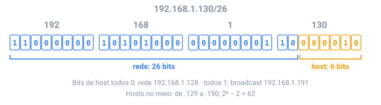

## Em resumo

A internet nunca manda um arquivo de uma vez. Ela corta os dados em **pacotes** de cerca de 1500 bytes, cada um com um **cabeçalho** (de onde vem e para onde vai) e um pedaço dos dados. Os **roteadores** passam cada pacote um salto mais perto do destino; os pacotes podem seguir caminhos diferentes e chegar fora de ordem.

Todo dispositivo tem um **endereço IP**: 4 bytes escritos como `192.168.1.130`, que para o computador são um único número de 32 bits. Um **prefixo** como `/26` diz quantos desses bits identificam a **rede**; o resto numera os **hosts** dentro dela.

Todos os bits de host 0 é o **endereço de rede**, todos 1 é o **endereço de broadcast**, e os endereços do meio são para os dispositivos. Um roteador escolhe para onde mandar um pacote pelo **maior prefixo** da sua tabela que corresponde ao destino.

Por cima do IP, o **TCP** numera os dados, confirma o que chegou e reenvia o que se perdeu, para que páginas e arquivos cheguem completos e em ordem. O **UDP** pula tudo isso, o que serve para chamadas de vídeo e jogos, em que um pacote atrasado não serve para nada. Antes de conectar, seu computador pergunta ao **DNS** o endereço de um nome como `example.com`. Depois o navegador abre uma conexão TCP e manda um pedido **HTTP**: `GET /index.html HTTP/1.1`.

<!-- readings -->

## Verifique

1. Por que uma chamada de vídeo usa UDP enquanto um download usa TCP?
2. Quais são os endereços de rede e de broadcast de `10.20.30.40/24`?
3. Um roteador tem rotas para `10.0.0.0/8` e `10.1.0.0/16`. Para onde ele manda um pacote para `10.1.2.3`, e por quê?
