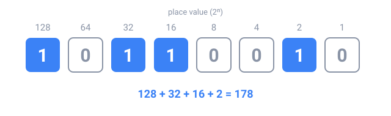

## Why it matters

A computer stores everything (numbers, text, pictures, your Java programs) as long sequences of **0s and 1s**. Each 0 or 1 is a **bit**, short for *binary digit*. Inside the chips, a bit is a tiny switch that is either off (0) or on (1).

To understand why an `int` has a limit, why colors look like `#FF8800`, or why `0.1 + 0.2` is not exactly `0.3`, you first need to read and write numbers in **binary**. The good news: binary works exactly like the decimal numbers you already know. Only the base changes.

## Place value: how decimal works

In the number **4705**, each digit is worth more or less depending on its **position**:

| Thousands | Hundreds | Tens | Ones |
|:---:|:---:|:---:|:---:|
| 4 | 7 | 0 | 5 |
| 4 × 1000 | 7 × 100 | 0 × 10 | 5 × 1 |

4000 + 700 + 0 + 5 = **4705**. Each position is worth 10 times the one to its right: 1, 10, 100, 1000. These are the powers of 10, because decimal has **base 10**: ten digits, 0 to 9.

## Binary: base 2

Binary has only two digits, 0 and 1, so each position is worth **2 times** the one to its right: 1, 2, 4, 8, 16, 32, 64, 128… These are the powers of 2.



To read a binary number, **add the place values that have a 1**. In the picture, `10110010` is 128 + 32 + 16 + 2 = **178**.

A smaller example: **1011** in binary has a 1 in the places worth 8, 2 and 1, so it is 8 + 2 + 1 = **11**. To avoid confusion, we write the base as a small number after it, 1011₂, or with the prefix `0b`, as Java does: `0b1011`.

## Counting in binary

| Decimal | Binary | | Decimal | Binary |
|:---:|:---:|:---:|:---:|:---:|
| 0 | 0 | | 5 | 101 |
| 1 | 1 | | 6 | 110 |
| 2 | 10 | | 7 | 111 |
| 3 | 11 | | 8 | 1000 |
| 4 | 100 | | 9 | 1001 |

When a position "runs out" of digits, it goes back to 0 and carries 1 to the left, just like 9 + 1 = 10 in decimal. In binary that happens at every 1: 1 + 1 = 10₂.

## From decimal to binary

**Divide by 2 repeatedly** and write down the remainders. Then read the remainders **from the last to the first**. For 13:

| Division | Quotient | Remainder |
|:---:|:---:|:---:|
| 13 ÷ 2 | 6 | **1** |
| 6 ÷ 2 | 3 | **0** |
| 3 ÷ 2 | 1 | **1** |
| 1 ÷ 2 | 0 | **1** |

Read upward: 13 = **1101₂**. Check: 8 + 4 + 1 = 13. ✓

Another way: find the largest power of 2 that fits (8 fits in 13), subtract it (13 − 8 = 5), and repeat with what is left (4 fits in 5, leaving 1, then 1 fits). The powers you used get a 1: 8, 4 and 1 give 1101₂.

## How many values fit in n bits?

Each extra bit **doubles** the number of combinations. With **n bits** there are **2ⁿ** different values, from 0 to 2ⁿ − 1:

- 1 bit: 2 values (0 and 1)
- 4 bits: 16 values (0 to 15)
- 8 bits, one **byte**: 256 values (0 to 255)

This is why so many limits in computing are powers of 2.

## Common mistakes

- **Reading the remainders top-down.** The first remainder is the *rightmost* bit.
- **Skipping the zeros in the middle.** 1001₂ is 9, not 3: every position counts, even with a 0.
- **Mixing bases.** "10" can mean ten (decimal) or two (binary). Write 10₂ or `0b10` when it is binary.

## In Java

You can write binary numbers directly in your code with the `0b` prefix:

```java
int flags = 0b1011;
IO.println(flags); // 11
```

Java can also convert for you, with `Integer.toBinaryString(11)`, which gives `"1011"`. In this unit's challenges you'll write those conversions yourself, so you really understand them.

## Key terms

- **Bit**: a binary digit, 0 or 1.
- **Base**: how many digits a number system has (decimal: 10, binary: 2).
- **Place value**: what a position is worth (a power of the base).
- **Most significant bit (MSB)**: the leftmost bit, worth the most.
- **Least significant bit (LSB)**: the rightmost bit, worth 1.
