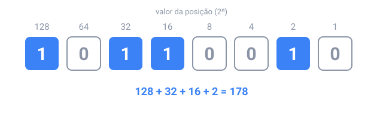

## Em resumo

No decimal, cada posição vale **10 vezes** a que está à sua direita: 4705 é 4 × 1000 + 7 × 100 + 0 × 10 + 5. O **binário** funciona do mesmo jeito com base **2**: só existem os dígitos 0 e 1, e as posições valem 1, 2, 4, 8, 16, … Para ler um número binário, some os valores das posições que têm 1:

Para fazer o caminho inverso, divida por 2 de novo e de novo; os restos, lidos do último para o primeiro, são os bits: 13 → `1101`.

Números binários longos são difíceis de ler, então os programadores usam o **hexadecimal**, base **16**: dígitos de 0 a 9 e depois de A a F para 10 a 15, com posições que valem 1, 16, 256, … Como 16 = 2⁴, **um dígito hex são exatamente 4 bits**, e um byte é sempre dois dígitos hex: `1011 0010` é `B2`. É por isso que cores (`#FF8800`), endereços de memória e códigos de erro são escritos em hex. O **octal** (base 8) agrupa os bits de três em três e é mais raro hoje.

O Java escreve todos eles: `0b1011` é binário, `0x2F` é hex, e um número que começa com `0`, como `010`, é **octal**, então quer dizer 8, não 10.

<!-- readings -->

## Verifique

1. Quanto é `1011 0010` em decimal, e em hex?
2. Por que um byte é sempre exatamente dois dígitos hex?
3. O que `IO.println(010 + 1)` imprime, e por quê?
