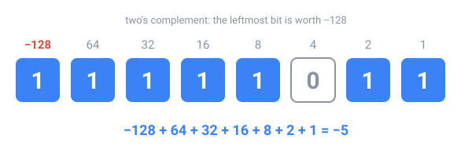

## In short

Bits have no minus sign, so computers use **two's complement**: in a byte, the leftmost bit is worth **−128** instead of +128, and the others keep their values. A byte then holds −128 to 127, and ordinary addition still works.

To negate a number, invert every bit and add 1: 5 is `00000101`, so −5 is `11111010` + 1 = `11111011`. Java's `int` uses 32 bits, from −2,147,483,648 to 2,147,483,647. When a result doesn't fit, the extra bits are dropped and it **wraps around**: `Integer.MAX_VALUE + 1` is `-2147483648`, and Java gives no error. This is **overflow**.

Fractions are harder. After the binary point the places are worth ½, ¼, ⅛, … so 0.5 and 0.25 are exact, but **0.1 repeats forever** in binary, like 1/3 in decimal. A `double` stores the closest value it can, in 64 bits: a sign, an exponent and 52 significant bits, about 15–16 decimal digits. That's why `0.1 + 0.2` prints `0.30000000000000004`.

So: compare doubles with a tolerance, `Math.abs(a - b) < 1e-9`, and keep money in whole cents in a `long`, or in `BigDecimal`.

<!-- readings -->

## Check yourself

1. What are the 8 bits of −1 in two's complement?
2. What does `(byte) 200` give in Java, and why?
3. Which of 0.5, 0.1 and 0.75 can a `double` store exactly?
