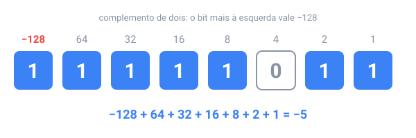

## Em resumo

Bits não têm sinal de menos, então os computadores usam **complemento de dois**: num byte, o bit mais à esquerda vale **−128** em vez de +128, e os outros mantêm seus valores. Um byte então guarda de −128 a 127, e a soma comum continua funcionando.

Para inverter o sinal de um número, inverta todos os bits e some 1: 5 é `00000101`, então −5 é `11111010` + 1 = `11111011`. O `int` do Java usa 32 bits, de −2.147.483.648 a 2.147.483.647. Quando um resultado não cabe, os bits extras são descartados e ele **dá a volta**: `Integer.MAX_VALUE + 1` é `-2147483648`, e o Java não dá erro. Isso é **overflow** (estouro).

Frações são mais difíceis. Depois da vírgula binária as posições valem ½, ¼, ⅛, … então 0,5 e 0,25 são exatos, mas **0,1 se repete para sempre** em binário, como 1/3 no decimal. Um `double` guarda o valor mais próximo que consegue, em 64 bits: um sinal, um expoente e 52 bits significativos, cerca de 15–16 dígitos decimais. É por isso que `0.1 + 0.2` imprime `0.30000000000000004`.

Então: compare doubles com uma tolerância, `Math.abs(a - b) < 1e-9`, e guarde dinheiro em centavos inteiros num `long`, ou em `BigDecimal`.

<!-- readings -->

## Verifique

1. Quais são os 8 bits de −1 em complemento de dois?
2. O que `(byte) 200` dá no Java, e por quê?
3. Quais de 0,5, 0,1 e 0,75 um `double` consegue guardar exatamente?
