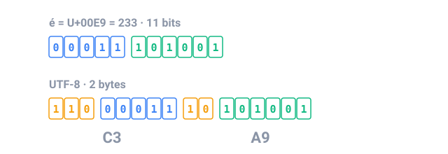

## In short

Computers store text as numbers: each character has a **code**. In **ASCII**, `A` is 65, `a` is 97, the digit `0` is 48 and the space is 32, and each lower-case letter is exactly 32 after its upper-case one. In Java a `char` is a number, so `'a' - 'A'` is 32.

ASCII has only 128 codes. **Unicode** numbers every character of every language, from é to 😀, with a **code point** such as `U+00E9`. **UTF-8** stores code points in 1 to 4 bytes: ASCII characters take 1, accented letters 2, emoji 4. Garbled text like "é" instead of "é" means UTF-8 bytes were read with the wrong table.

Images are grids of **pixels**, and each pixel usually takes 3 bytes: red, green and blue, from 0 to 255, which is what a hex color like `#FF8800` writes. Sound is stored as **samples**: CDs measure the sound wave 44,100 times per second, with 16 bits per sample and 2 channels.

Raw media is big, so it is **compressed**. **Lossless** compression (PNG, ZIP, run-length encoding) gives back every bit; **lossy** compression (JPEG, MP3) also drops details people barely notice and gets files ten times smaller.

<!-- readings -->

## Check yourself

1. What does `(char) ('g' - 32)` give, and why?
2. How many bytes does a 1920 × 1080 image take before compression, with 3 bytes per pixel?
3. Why does run-length encoding make `ABCDEF` longer instead of shorter?
