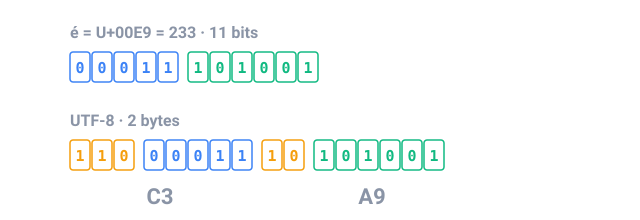

## Em resumo

Os computadores guardam texto como números: cada caractere tem um **código**. No **ASCII**, `A` é 65, `a` é 97, o dígito `0` é 48 e o espaço é 32, e cada letra minúscula fica exatamente 32 depois da sua maiúscula. No Java um `char` é um número, então `'a' - 'A'` é 32.

O ASCII só tem 128 códigos. O **Unicode** numera todos os caracteres de todos os idiomas, de é a 😀, com um **code point** como `U+00E9`. O **UTF-8** guarda code points em 1 a 4 bytes: caracteres ASCII ocupam 1, letras com acento 2, emoji 4. Texto embaralhado como "é" no lugar de "é" quer dizer que bytes UTF-8 foram lidos com a tabela errada.

Imagens são grades de **pixels**, e cada pixel normalmente ocupa 3 bytes: vermelho, verde e azul, de 0 a 255, que é o que uma cor em hex como `#FF8800` escreve. O som é guardado como **amostras**: os CDs medem a onda sonora 44.100 vezes por segundo, com 16 bits por amostra e 2 canais.

Mídia sem compressão é grande, então ela é **comprimida**. A compressão **sem perda** (PNG, ZIP, codificação por comprimento de sequência) devolve cada bit; a compressão **com perda** (JPEG, MP3) também descarta detalhes que as pessoas mal percebem e deixa os arquivos dez vezes menores.

<!-- readings -->

## Verifique

1. O que `(char) ('g' - 32)` dá, e por quê?
2. Quantos bytes uma imagem de 1920 × 1080 ocupa antes da compressão, com 3 bytes por pixel?
3. Por que a codificação por comprimento de sequência deixa `ABCDEF` mais longo em vez de mais curto?
